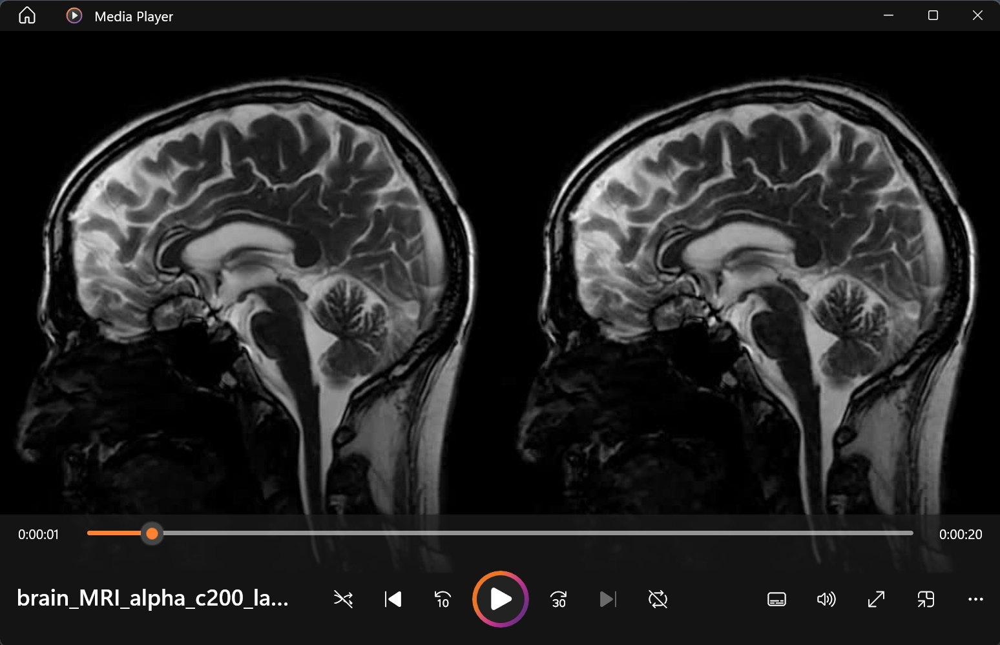

# Motion Amplification and Amplified MRI

### Dataset:
[Baby & Subway](https://people.csail.mit.edu/mrub/evm/)
[MRI](https://www.youtube.com/watch?v=1t5sEHEEYlQ)

### Build: 

	CPU: Intel i9-13900H (14 cores)
	GPU: NVIDIA RTX 4060 (VRAM 8 GB)
	RAM: 32 GB

### Python Packages:
	
	conda install -c conda-forge opencv=4.7.0
	conda install -c conda-forge scipy=1.14.0
	conda install -c conda-forge scikit-image
	conda install -c conda-forge matplotlib=3.9.1
	conda install -c conda-forge pyrtools==1.0.0

### Credits:

	"Eulerian video magnification for revealing subtle changes in the world". https://doi.org/10.1145/2185520.2185561 
	"Amplified magnetic resonance imaging (aMRI)". DOI: 10.1002/mrm.26142 